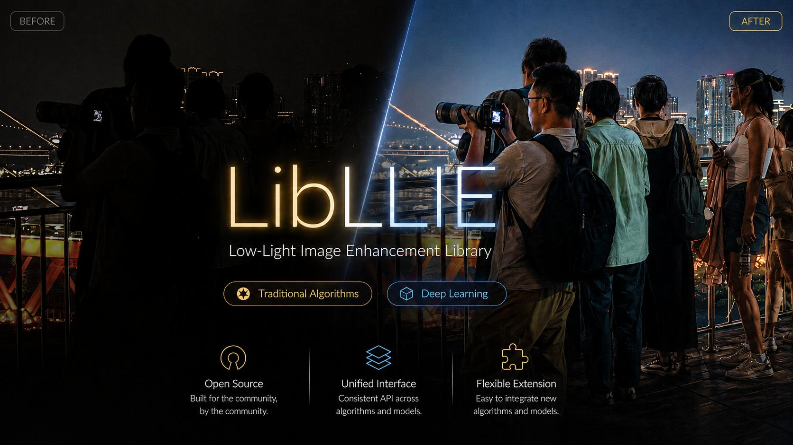

<div align="center">
  <p>
    
  </p>


  <h1>LibLLIE</h1>

  <p>
    A unified Python toolkit for low-light image enhancement.
  </p>

  <p>
    <a href="https://www.python.org/"></a>
    <a href="https://pytorch.org/"></a>
    <a href="LICENSE"></a>
  </p>

  <p>
    <a href="docs/guide/overview.md">English Docs</a> |
    <a href="docs-zh-CN/guide/overview.md">中文文档</a> |
    <a href="docs/usage/cli.md">CLI</a> |
    <a href="docs/usage/cfg.md">Configuration</a>
  </p>
</div>

LibLLIE is an open-source library for **low-light image enhancement (LLIE)**.
It brings traditional enhancement algorithms, deep-learning models, training, prediction, image I/O, and evaluation into one consistent interface.

The library is built for research and experimentation: you can quickly compare classical methods, run or train neural models, evaluate enhanced images, and extend the framework with your own models, losses, datasets, algorithms, or
metrics.

## Highlights

- Unified top-level API: `predict`, `train`, `evaluate`, `imread`, `imwrite`.
- Training pipeline with YAML configuration, checkpoints, validation, and resumable experiments.
- Evaluation utilities for full-reference and no-reference image quality metrics such as PSNR, SSIM, MSE, MAE, LPIPS, LOE, NIQE, MUSIQ, and PI.
- Automatic component registration for custom extensions.

## Documentation

See below for a compact quick start. For complete guidance, use the full docs:

| Topic | English | Chinese |
| --- | --- | --- |
| API overview | [docs/guide/overview.md](docs/guide/overview.md) | [docs-zh-CN/guide/overview.md](docs-zh-CN/guide/overview.md) |
| Image I/O | [docs/guide/image_io.md](docs/guide/image_io.md) | [docs-zh-CN/guide/image_io.md](docs-zh-CN/guide/image_io.md) |
| Prediction | [docs/guide/predict.md](docs/guide/predict.md) | [docs-zh-CN/guide/predict.md](docs-zh-CN/guide/predict.md) |
| Training | [docs/guide/train.md](docs/guide/train.md) | [docs-zh-CN/guide/train.md](docs-zh-CN/guide/train.md) |
| Evaluation | [docs/guide/evaluate.md](docs/guide/evaluate.md) | [docs-zh-CN/guide/evaluate.md](docs-zh-CN/guide/evaluate.md) |
| CLI | [docs/usage/cli.md](docs/usage/cli.md) | [docs-zh-CN/usage/cli.md](docs-zh-CN/usage/cli.md) |
| Configuration | [docs/usage/cfg.md](docs/usage/cfg.md) | [docs-zh-CN/usage/cfg.md](docs-zh-CN/usage/cfg.md) |

<details open>
<summary>Install</summary>

LibLLIE requires **Python>=3.8** and **PyTorch>=2.0**.

Clone the repository, then install from source when developing or using the
latest GitHub version:

```bash
cd LibLLIE
pip install -e .
```

also, you can install it as a regular package: (Not yet implemented.)

```bash
pip install libllie
```

</details>

<details open>
<summary>Quick Start</summary>
### CLI

你可以使用'libllie'或者'llie'作为命令

```bash
# List registered models, algorithms, metrics, losses, and datasets
libllie list # or llie list

# Enhance one image with a traditional method
libllie predict he input.jpg -o results/he_output.png
# or
llie predict he input.jpg -o results/he_output.png

# Evaluate enhanced images
libllie evaluate --en-img-dir path/to/enhanced/images/dir --ref-img-dir path/to/reference/images/dir --metrics PSNR SSIM
# or
llie eval --en path/to/enhanced/images/dir --ref path/to/reference/images/dir --metrics PSNR SSIM
```

### Python

对于传统算法，只需要给定算法名称，和需要被增强的低光增强图像即可。

```python
import libllie as llie

enhanced, saved_path = llie.predict(
    "he",
    "input.jpg",  # low-light-image
    output="results/he_output.png",
)
```

For deep-learning inference, pass a trained checkpoint path:

```python
enhanced, saved_path = llie.predict(
    "path/to/llie.pt",
    "input.jpg",
    output="results/zerodce_output.png",
    device="cuda",
)
```

</details>

## Supported Components

<details open>
<summary>Deep-Learning Models</summary>

| Model | years | venue | paper | official code |
| --- | --- | --- | --- | --- |
| [Zero-DCE](docs/models/zero-dce.md) | 2020 | CVPR | [paper](https://openaccess.thecvf.com/content_CVPR_2020/papers/Guo_Zero-Reference_Deep_Curve_Estimation_for_Low-Light_Image_Enhancement_CVPR_2020_paper.pdf) | [code](https://github.com/Li-Chongyi/Zero-DCE) |
| [Zero-DCE++](docs/models/zero-dce++.md) | 2021 | IEEE TPAMI | [paper](https://ieeexplore.ieee.org/document/9369102/) | [code](https://github.com/Li-Chongyi/Zero-DCE_extension) |
| [SCI](docs/models/sci.md) | 2022 | CVPR | [paper](https://openaccess.thecvf.com/content/CVPR2022/papers/Ma_Toward_Fast_Flexible_and_Robust_Low-Light_Image_Enhancement_CVPR_2022_paper.pdf) | [code](https://github.com/vis-opt-group/SCI) |
| [RUAS](docs/models/ruas.md) | 2021 | CVPR | [paper](https://openaccess.thecvf.com/content/CVPR2021/papers/Liu_Retinex-Inspired_Unrolling_With_Cooperative_Prior_Architecture_Search_for_Low-Light_Image_CVPR_2021_paper.pdf) | [code](https://github.com/KarelZhang/RUAS) |
| [URetinex-Net](docs/models/uretinex-net.md) | 2022 | CVPR | [paper](https://openaccess.thecvf.com/content/CVPR2022/papers/Wu_URetinex-Net_Retinex-Based_Deep_Unfolding_Network_for_Low-Light_Image_Enhancement_CVPR_2022_paper.pdf) | [code](https://github.com/AndersonYong/URetinex-Net) |
| [RetinexFormer](docs/models/retinexformer.md) | 2023 | ICCV | [paper](https://openaccess.thecvf.com/content/ICCV2023/papers/Cai_Retinexformer_One-stage_Retinex-based_Transformer_for_Low-light_Image_Enhancement_ICCV_2023_paper.pdf) | [code](https://github.com/caiyuanhao1998/Retinexformer) |
| [LEDNet](docs/models/lednet.md) | 2022 | ECCV | [paper](https://arxiv.org/pdf/2202.03373) | [code](https://github.com/sczhou/LEDNet) |
| [Zero-IG](docs/models/zero-ig.md) | 2024 | CVPR | [paper](https://openaccess.thecvf.com/content/CVPR2024/papers/Shi_ZERO-IG_Zero-Shot_Illumination-Guided_Joint_Denoising_and_Adaptive_Enhancement_for_Low-Light_CVPR_2024_paper.pdf) | [code](https://github.com/Doyle59217/ZeroIG) |
| [DarkIR](docs/models/darkir.md) | 2025 | CVPR | [paper](https://openaccess.thecvf.com/content/CVPR2025/papers/Feijoo_DarkIR_Robust_Low-Light_Image_Restoration_CVPR_2025_paper.pdf) | [code](https://github.com/cidautai/DarkIR) |
| [LLNet](docs/models/llnet.md) | 2017 | Pattern Recognition | [paper](https://doi.org/10.1016/j.patcog.2016.06.008) | [code](https://github.com/kglore/llnet_color) |
| [KinD](docs/models/kind.md) | 2019 | ACM MM | [paper](https://doi.org/10.1145/3343031.3350926) | [code](https://github.com/zhangyhuaee/KinD) |
| [KinD++](docs/models/kind++.md) | 2021 | IJCV | [paper](https://doi.org/10.1007/s11263-020-01407-x) | [code](https://github.com/zhangyhuaee/KinD_plus) |
| [EnlightenGAN](docs/models/enlightengan.md) | 2021 | IEEE TIP | [paper](https://doi.org/10.1109/TIP.2021.3051462) | [code](https://github.com/VITA-Group/EnlightenGAN) |
| [LLFlow](docs/models/llflow.md) | 2022 | AAAI | [paper](https://doi.org/10.1609/aaai.v36i3.20162) | [code](https://github.com/wyf0912/LLFlow) |

</details>

<details>
<summary>Traditional Algorithms</summary>

| Algorithm | Documentation |
| --- | --- |
| HE | [docs/algorithms/he.md](docs/algorithms/he.md) |
| AHE | [docs/algorithms/ahe.md](docs/algorithms/ahe.md) |
| CLAHE | [docs/algorithms/clahe.md](docs/algorithms/clahe.md) |
| RCLAHE | [docs/algorithms/rclahe.md](docs/algorithms/rclahe.md) |
| Gamma | [docs/algorithms/gamma.md](docs/algorithms/gamma.md) |
| GCP | [docs/algorithms/gcp.md](docs/algorithms/gcp.md) |
| LIME | [docs/algorithms/lime.md](docs/algorithms/lime.md) |
| BIMEF | [docs/algorithms/bimef.md](docs/algorithms/bimef.md) |
| NPE | [docs/algorithms/npe.md](docs/algorithms/npe.md) |
| Retinex | [docs/algorithms/retinex.md](docs/algorithms/retinex.md) |
| Log | [docs/algorithms/log.md](docs/algorithms/log.md) |
| DCP | [docs/algorithms/dcp.md](docs/algorithms/dcp.md) |

</details>

<details>
<summary>Evaluation Metrics</summary>

| Type | Metrics |
| --- | --- |
| Full-reference | PSNR, SSIM, MSE, MAE, LPIPS, LOE |
| No-reference | NIQE, MUSIQ, PI |

See [docs/guide/evaluate.md](docs/guide/evaluate.md) and
[docs/custom/metric.md](docs/custom/metric.md) for usage and extension details.

</details>

## Training

LibLLIE provides a unified trainer for registered models and datasets. You can
train through keyword arguments:

```python
import libllie as llie

llie.train(
    model="ZeroDCE",
    dataset="CommonDataset",
    root_dir="datasets/LOL",
    loss="zerodce",
    epochs=10,
    batch_size=4,
    device="cuda",
)
```

Or train from YAML:

```python
llie.train("libllie/deepLearning/config/ZeroDCE.yaml")
```

Training outputs are saved under `checkpoints/{Model}_{Dataset}` by default,
including checkpoints, logs, and the resolved training configuration.

## Extension System

LibLLIE uses automatic registration for major components. After a custom
component is imported, it can be listed and used through the same top-level API.

| Component | Base class | Guide |
| --- | --- | --- |
| Deep-learning model | `LLIEModel` | [custom model](docs/custom/model.md) |
| Training loss | `BaseLoss` | [custom loss](docs/custom/loss.md) |
| Dataset | `BaseDataset` | [custom dataset](docs/custom/dataset.md) |
| Traditional algorithm | `LLIEnhancer` | [custom algorithm](docs/custom/algorithm.md) |
| Evaluation metric | `BaseMetric` | [custom metric](docs/custom/metric.md) |

## Project Layout

```text
libllie/
  data/            Image I/O, transforms, datasets
  traditional/     Traditional LLIE algorithms
  deepLearning/    Models, losses, trainer, predictor, YAML configs
  evaluation/      Evaluator and image quality metrics
docs/              English documentation
docs-zh-CN/        Chinese documentation
examples/          Runnable examples
test/              Test suite
```

## Testing

Run the test suite:

```bash
python -m pytest -q test
```

## Contributing

Contributions are welcome. Good first contributions include:

- adding or improving algorithm documentation,
- adding examples for existing models,
- implementing new LLIE algorithms or metrics,
- improving tests for training, prediction, and evaluation workflows.

Please keep new components consistent with the existing registration system and
add focused tests when behavior changes.

## License

LibLLIE is released under the MIT License. See [LICENSE](LICENSE).

## Contact

Glory Wan  
glory947446@gmail.com
